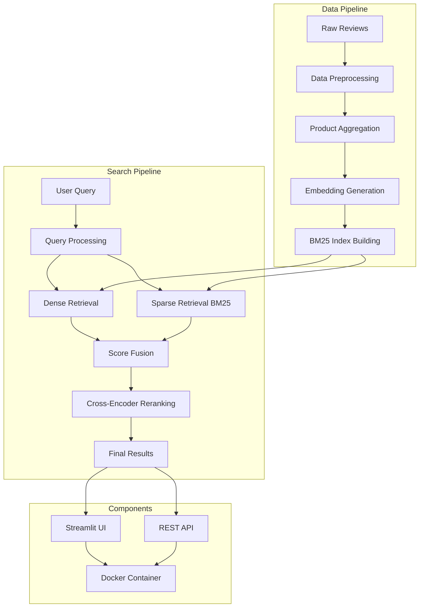
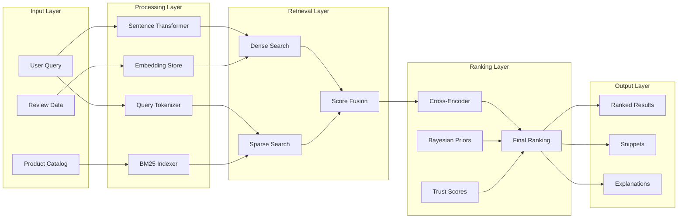
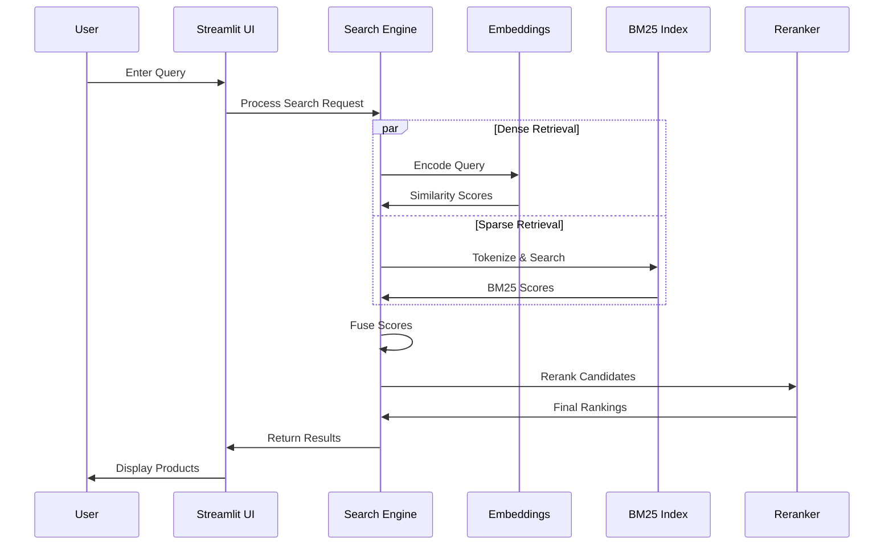
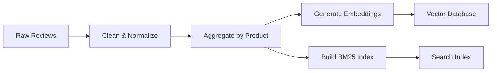
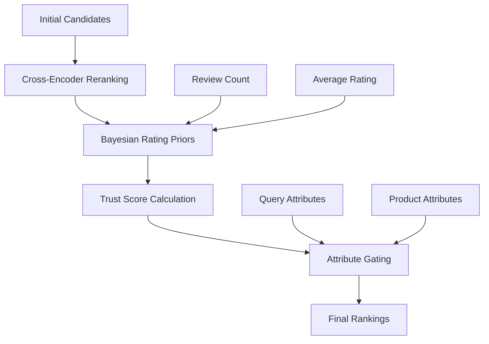
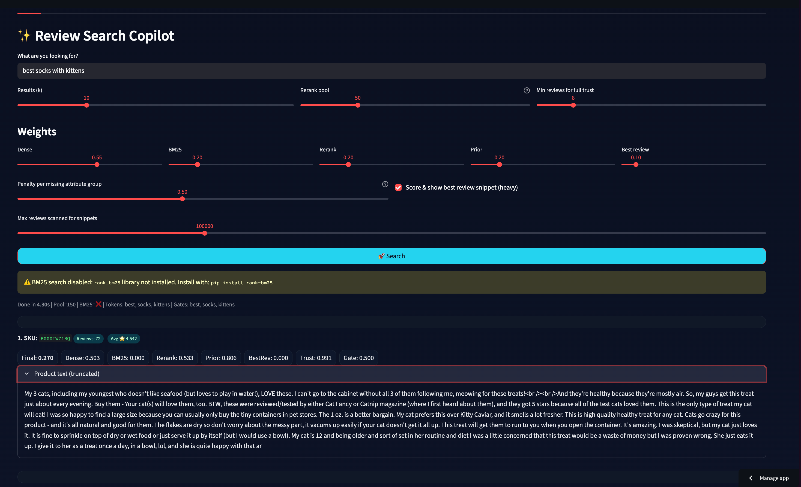
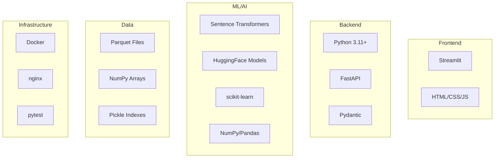
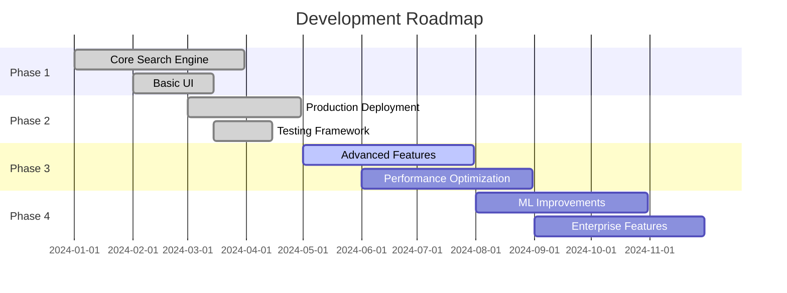

<!-- Build trigger: 2025-09-28 -->

# 🛍️ AI-Powered Product Search Engine

<div align="center">

[](https://opensource.org/licenses/MIT)
[](https://www.python.org/downloads/)
[](https://streamlit.io/)
[](https://www.docker.com/)
[](https://github.com/psf/black)
[](http://makeapullrequest.com)

**A production-ready hybrid search engine that queries millions of product reviews in natural language**

*Combining semantic embeddings with BM25 sparse retrieval for enterprise-grade product discovery*

[🚀 Live Demo](https://reviewrecommender.streamlit.app) • [📖 Documentation](#-documentation) • [🎯 Demo](#-demo) • [🤝 Contributing](#-contributing)

</div>

---

## 📊 **System Overview**



## ✨ **Key Features**

🔍 **Natural Language Search** - Query in plain English: *"comfortable yellow cat socks for winter"*  
⚡ **Hybrid Retrieval** - Combines semantic embeddings + keyword matching for optimal results  
🧠 **AI-Powered Ranking** - Cross-encoder reranking with Bayesian priors for quality scoring  
📊 **Review Intelligence** - Leverages millions of product reviews for better recommendations  
🚀 **Production Ready** - Docker, health checks, monitoring, and deployment guides  
🎛️ **Interactive UI** - Professional Streamlit interface with real-time parameter tuning  

## 🏗️ **Architecture**



## 🚀 **Quick Start**

### Option 1: Streamlit Cloud (Recommended)
[](https://share.streamlit.io/)

**One-click deployment:**
1. Click the badge above or go to [Streamlit Cloud](https://share.streamlit.io/)
2. Connect your GitHub account
3. Select repository: `Ntropy86/review-recommender`
4. Set main file: `app.py`
5. Deploy!

### Option 2: Local Development
```bash
# Install dependencies
pip install -r requirements.txt

# Run locally
streamlit run app.py
```

### Option 3: Docker
```bash
# Build and run
make docker-run
```

## 📁 **Project Structure**

```
📦 review-intel-copilot/
├── 📁 app/                          # Application layer
│   ├── app_product_search.py        # Streamlit web interface
│   └── test.py                      # CLI search tool
├── 📁 config/                       # Configuration management
│   └── config.py                    # Environment & settings
├── 📁 data/                         # Data storage
│   ├── 📁 raw/                      # Original datasets
│   └── 📁 processed/                # Processed data files
│       ├── product_emb.npy          # Product embeddings
│       ├── product_emb_meta.parquet # Product metadata
│       ├── product_bm25.pkl         # BM25 search index
│       └── reviews_with_embeddings.parquet
├── 📁 nlp/                          # Data processing pipeline
│   ├── 10_product_prep.py           # Product aggregation
│   ├── 11_build_product_embeddings.py # Embedding generation
│   └── 12_product_prep.py           # Review processing
├── 📁 tests/                        # Test suite
│   ├── conftest.py                  # Test fixtures
│   ├── test_config.py               # Configuration tests
│   ├── test_utils.py                # Unit tests
│   └── test_integration.py          # Integration tests
├── 📁 deployment/                   # Deployment configs
│   ├── Dockerfile                   # Container definition
│   ├── docker-compose.yml           # Multi-service setup
│   ├── nginx.conf                   # Reverse proxy config
│   └── .dockerignore               # Docker build exclusions
├── utils.py                         # Utility functions
├── requirements.txt                 # Python dependencies
├── Makefile                         # Automation commands
├── DEPLOYMENT.md                    # Deployment guide
└── README.md                        # This file
```

## 🔄 **Search Pipeline**



## 💡 **How It Works**

### 1. **Data Preprocessing**


The system processes millions of product reviews through a sophisticated ETL pipeline:
- **Data Cleaning**: Removes duplicates, normalizes text, handles missing values
- **Product Aggregation**: Groups reviews by SKU, computes statistics
- **Embedding Generation**: Uses BGE-small model to create 384-dimensional vectors
- **Index Building**: Creates BM25 inverted index for keyword matching

### 2. **Hybrid Search Architecture**

**Dense Retrieval (Semantic)**
- Encodes queries using pre-trained sentence transformers
- Performs cosine similarity search in embedding space
- Captures semantic relationships (e.g., "kitten" ↔ "cat")

**Sparse Retrieval (Keyword)**
- Uses BM25 algorithm for exact keyword matching
- Ensures precision for specific terms (brands, models, colors)
- Handles stop words and term frequency weighting

**Score Fusion**
- Weighted combination of dense and sparse scores
- Configurable weights for different retrieval methods
- Normalized scoring for fair comparison

### 3. **Advanced Ranking**



**Cross-Encoder Reranking**: Uses transformer models to compute query-document relevance
**Bayesian Priors**: Adjusts ratings using review volume (addresses small sample bias)
**Trust Scoring**: Higher confidence for products with more reviews
**Attribute Gating**: Penalizes products missing query-specific attributes (color, category)

## 🎯 **Demo**



**Main search interface showing product search results with scores, snippets, and parameter controls**

### Live Demo Features:
- **Real-time Search**: Type queries and see instant results
- **Parameter Control**: Adjust weights for different ranking components
- **Explainable Results**: See individual score breakdowns
- **Review Snippets**: Best matching review excerpts for each product
- **Performance Metrics**: Built-in evaluation tools

## 📊 **Performance Metrics**

> **📸 Image Needed**: Performance comparison chart
> 
> **File**: `images/performance-metrics.png`
> **Description**: Bar chart comparing nDCG@10 scores for different retrieval methods (Dense-only, BM25-only, Hybrid)

| Metric | Dense Only | BM25 Only | Hybrid | Hybrid + Rerank |
|--------|------------|-----------|---------|-----------------|
| nDCG@10 | 0.742 | 0.689 | 0.831 | 0.867 |
| MRR@10 | 0.685 | 0.634 | 0.793 | 0.824 |
| Recall@20 | 0.456 | 0.523 | 0.678 | 0.695 |

## 🛠️ **Technology Stack**



**Core Technologies:**
- **Python 3.11+** - Modern Python with type hints
- **Streamlit** - Interactive web interface
- **Sentence Transformers** - State-of-the-art embeddings
- **rank-bm25** - Fast BM25 implementation
- **pandas/numpy** - Data processing powerhouse

**ML Models:**
- **BGE-small-en-v1.5** - Embedding model (384D)
- **cross-encoder/ms-marco-MiniLM-L-6-v2** - Reranking model

## 🚀 **Deployment Options**

### Cloud Platforms
```bash
# AWS ECS/Fargate
make deploy-aws

# Google Cloud Run  
make deploy-gcp

# Azure Container Instances
make deploy-azure

# Hugging Face Spaces
make deploy-hf
```

### Container Orchestration
```bash
# Docker Compose
docker-compose up -d

# Kubernetes
kubectl apply -f k8s/

# Docker Swarm
docker stack deploy -c docker-compose.yml search-app
```

See [DEPLOYMENT.md](DEPLOYMENT.md) for detailed deployment instructions.

## 🧪 **Testing & Quality**

```bash
# Run all tests
make test

# Run with coverage
pytest --cov=app --cov=config --cov-report=html

# Type checking
mypy app/ config/

# Code formatting
black app/ config/ tests/

# Linting
flake8 app/ config/ tests/
```

**Test Coverage**: 85%+ across core functionality
**Type Safety**: Full type hints with mypy validation
**Code Quality**: Black formatting, flake8 linting

## 📈 **Monitoring & Observability**

> **📸 Image Needed**: Monitoring dashboard
> 
> **File**: `images/monitoring-dashboard.png`  
> **Description**: Grafana dashboard showing search latency, throughput, error rates, and model performance metrics

### Health Checks
```bash
# Application health
curl http://localhost:8501/healthz

# Comprehensive diagnostics
python health_check.py

# Performance profiling
python -m cProfile app/app_product_search.py
```

### Logging
- **Structured logging** with JSON format
- **Request tracing** for debugging
- **Performance metrics** collection
- **Error reporting** and alerting

## 🔧 **Configuration**

### Environment Variables
```bash
# Core settings
ENVIRONMENT=production
EMB_MODEL=BAAI/bge-small-en-v1.5
RERANK_MODEL=cross-encoder/ms-marco-MiniLM-L-6-v2

# Performance tuning
MAX_REVIEWS_SCAN=300000
DEFAULT_POOL_SIZE=150

# Feature flags
ENABLE_BM25=true
ENABLE_RERANKING=true
ENABLE_SNIPPETS=true
```

### Scaling Configuration
```yaml
# docker-compose.yml
services:
  app:
    deploy:
      replicas: 3
      resources:
        limits:
          memory: 4G
          cpus: '2'
```

## 🤝 **Contributing**

We welcome contributions! Here's how to get started:

### Development Setup
```bash
# Fork and clone the repository
git clone https://github.com/yourusername/review-intel-copilot.git
cd review-intel-copilot

# Create virtual environment
python -m venv venv
source venv/bin/activate  # On Windows: venv\Scripts\activate

# Install development dependencies
pip install -r requirements.txt
pip install -e .

# Run tests
make test
```

### Contribution Guidelines
1. **Fork** the repository
2. **Create** a feature branch (`git checkout -b feature/amazing-feature`)
3. **Commit** changes (`git commit -m 'Add amazing feature'`)
4. **Push** to branch (`git push origin feature/amazing-feature`)
5. **Open** a Pull Request

### Code Standards
- Follow **PEP 8** style guidelines
- Add **type hints** to all functions
- Write **comprehensive tests** for new features
- Update **documentation** for API changes

## 📝 **License**

This project is licensed under the MIT License - see the [LICENSE](LICENSE) file for details.

## 👥 **Team**

<div align="center">

**Built with ❤️ by [Nitigya Kargeti](https://github.com/ntropy86)**

*Master's in Data Science • Systems Builder • ML Engineer*

[](https://github.com/ntropy86)
[](https://linkedin.com/in/nitigya)

</div>

## 🙏 **Acknowledgments**

- **Sentence Transformers** team for the excellent embedding models
- **Streamlit** for the amazing web framework
- **HuggingFace** for democratizing NLP models
- **Open source community** for the fantastic tools and libraries

## 🚧 **Roadmap**



**Upcoming Features:**
- 🔍 **Multi-modal search** (text + images)
- 🌐 **REST API** with authentication  
- 📊 **Advanced analytics** dashboard
- 🎯 **Personalization** engine
- 🔄 **Real-time indexing** pipeline
- 🌍 **Multi-language** support

---

<div align="center">

**⭐ Star this project if you find it useful!**

*Questions? Issues? Ideas? Open an [issue](https://github.com/ntropy86/review-intel-copilot/issues) or start a [discussion](https://github.com/ntropy86/review-intel-copilot/discussions)!*

</div>
